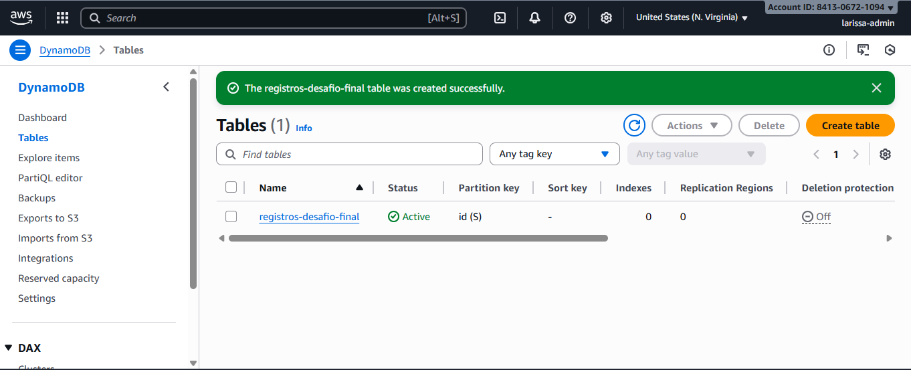
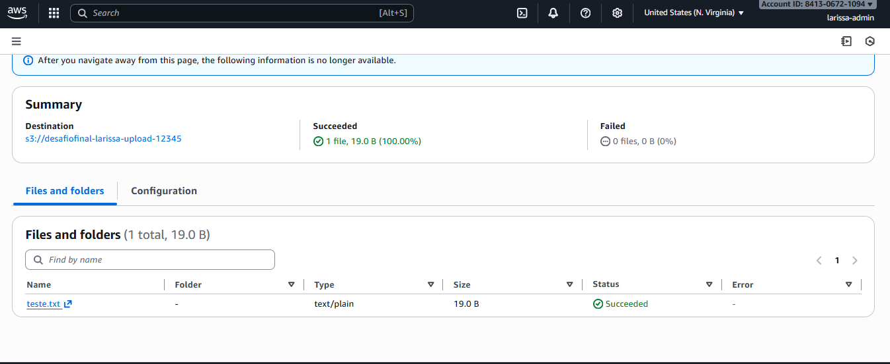

# Desafio de Projeto Final: Automação Serverless (S3 -> Lambda -> DynamoDB)

Este é o repositório do meu Desafio de Projeto Final do Santander Code Girls, focado na criação de uma arquitetura serverless automatizada.

## 🤯 O Grande Aprendizado (Conectando Tudo!)

Este foi, sem dúvida, o desafio mais complexo e o que mais me ensinou. Ele conectou todos os pontos de "serverless" (S3, Lambda) com um banco de dados (DynamoDB).

A minha maior dificuldade foi entender como **dar as permissões corretas**. A Função Lambda não podia falar com o DynamoDB até que eu criei uma **IAM Role** (`Role-DesafioFinal-Lambda`) e anexei as permissões corretas (`AmazonS3ReadOnlyAccess` e `AmazonDynamoDBFullAccess`). Foi o "clique" que fez tudo funcionar!

## 🚀 O Workflow Automatizado que eu Criei

Eu construí um fluxo de trabalho orientado a eventos (event-driven) 100% na AWS:

1.  **O Gatilho (Trigger):** Criei um **Bucket S3** (`desafiofinal-larissa-upload...`) para receber arquivos.
2.  **O Cérebro (Action):** Criei uma **Função Lambda** (`Funcao-DesafioFinal-S3-Dynamo`) com um código em Python (anexado neste repositório).
3.  **O Registro (Database):** Criei uma tabela no **DynamoDB** (`registros-desafio-final`) para armazenar os logs.

**O Fluxo Completo:**
* Quando um arquivo novo é enviado para o S3...
* ...o S3 **automaticamente dispara** a Função Lambda (graças ao "Trigger" que eu configurei).
* ...a Lambda (usando Python e Boto3) **lê** o nome do arquivo e **escreve** esse nome na tabela do DynamoDB.

## ✅ O Teste (A Prova Real)

Ao fazer o upload de um arquivo de teste no S3, o registro apareceu quase instantaneamente na minha tabela DynamoDB. Isso provou que a automação serverless funcionou perfeitamente!

## 📸 Provas (Screenshots)

Abaixo estão os prints do processo:

## 🧹 Limpeza (O Mais Importante!)

Ao final, para não gerar custos desnecessários, todos os recursos foram deletados: o Bucket S3, a Função Lambda, a Tabela DynamoDB e a IAM Role.
